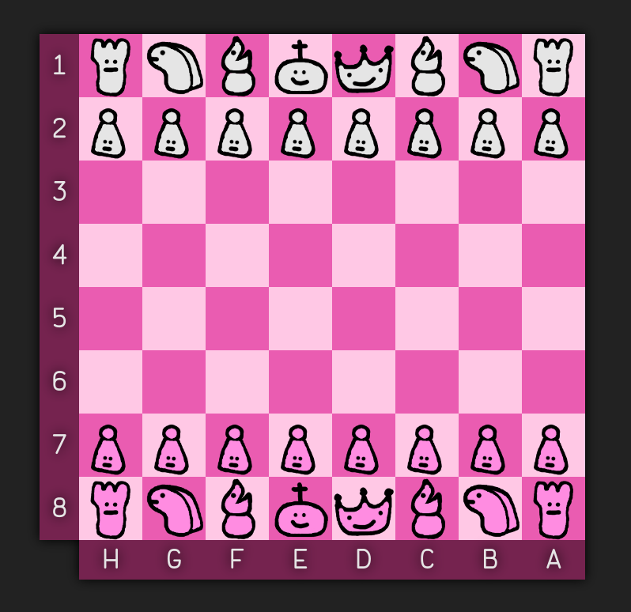
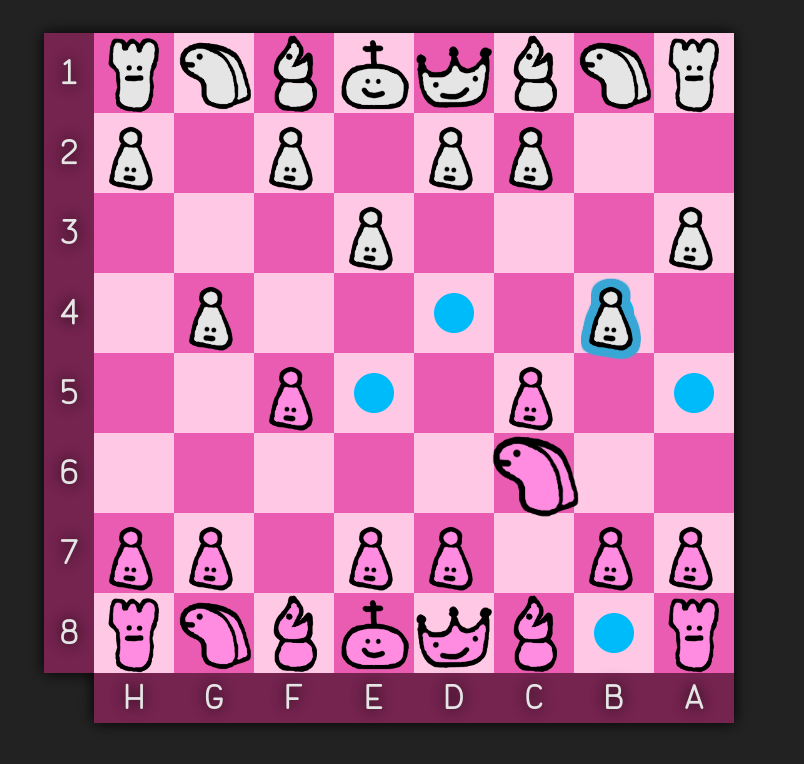
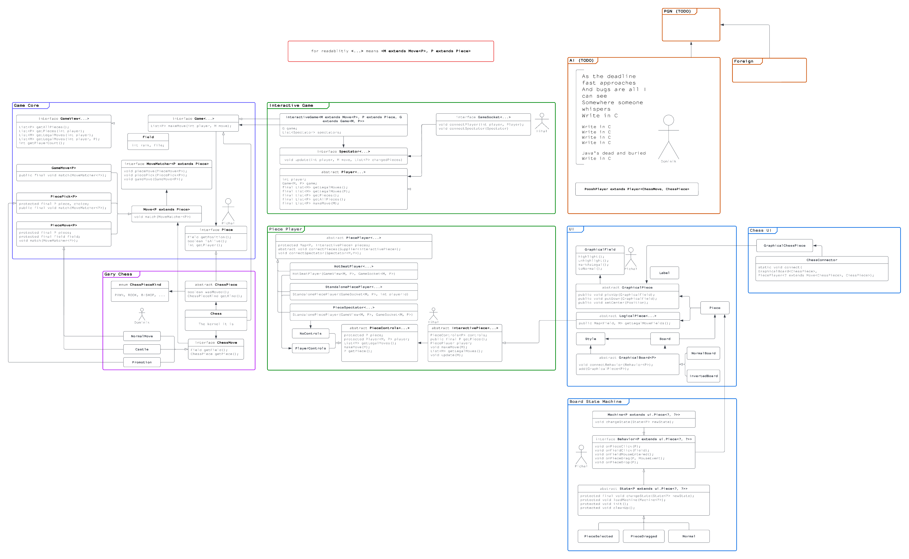

# chess

Chess made as an assignment project for OOP course 2021/22

## Roadmap

### 5-05-2022 goals

- [x] basic UI interactions
- [x] game skeleton
- [x] integrating ui with game core

# Screenshots

# Project architecture

