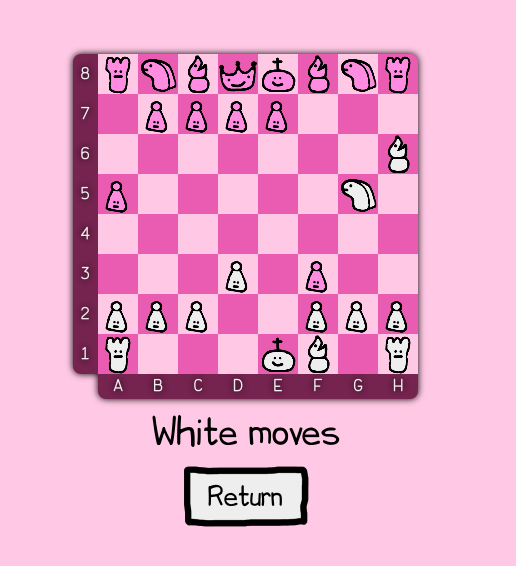
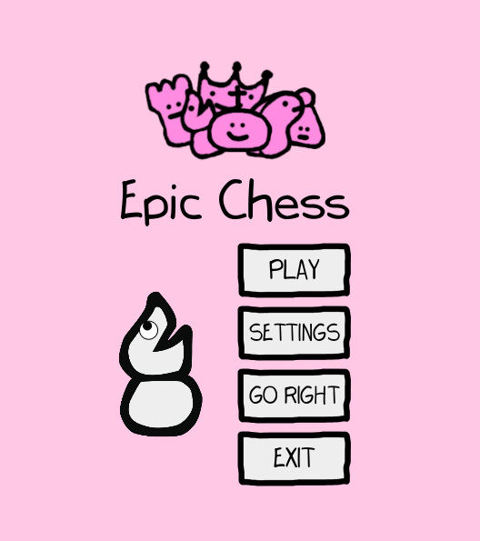

# chess

Chess made as an assignment project for OOP course 2021/22

## Installation
Project is built with [Maven](https://maven.apache.org/)

1. Clone the repository
2. In the directory containing `pom.xml` run `mvn clean javafx:run`
3. Alternatively you can run `app.Main` class from your IDE

## Changelog

### 5-05-2022 goals [Completed]

- [x] basic UI interactions
- [x] game skeleton
- [x] integrating ui with game core

### 26-06-2022 goals [Completed]
- [x] menus
- [x] color scheme selection
- [x] complete chess logic
- [x] optional chess configuration (for now at compile time)
- [x] api for external players and ai (almost)
- [x] checkers and minesweeper

# Screenshots

# Project architecture

